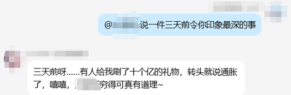

<p align="center"></p>

# 灵魂景观 Mindscape · AstrBot 插件

> 给 bot 补上认知、表达、沉浸、唤醒四层能力。



## 它做什么

### 一、认知层 —— 长期记忆

每轮在字数预算内装配五层上下文，超预算时从最不重要的层开始砍：

| 层 | 内容 |
|---|---|
| 规矩 | 这个 bot 自己的行为约束，优先级最高 |
| 账本 | bot 用 `save_note` 工具自己维护的记事 |
| 风格 | 它平时怎么说话（稳定层 + 近期层） |
| 摘要 | 每天一句骨架 |
| 原文 | 事件原文，滑动窗口 |

**这里没有用向量库。** 取舍的理由是：角色 bot 需要的是「按时间发生的事」，
而不是「和当前话题最相似的片段」—— 人设的连续性来自顺序。

### 二、表达层 —— 语气与表情

- **表情包采集**：视觉模型判断图片是否契合人设，契合的入库并打标签
- **按语境选图** + 概率调度
- **斗图队形**：群里开始刷图时跟进

### 三、沉浸层 —— 不出戏

- **报错拦截**：命中错误特征的回复整条清空，不会把框架报错发进群
- **输出规范化**：压平多段、去掉 AI 腔
- **空回复救援**：只吐思考过程、正文为空时，补一次轻量调用兜住
- **沉默**：不想说话时只输出一个标记，发送前整条回复被清空 —— 那一轮群里**没有任何消息**


### 四、唤醒层 —— 什么时候该接话

- `@` 必回、正文提到名字必回
- **定向性判定**：区分「@ 我」「正文提到我」「@ 别人但昵称像我」「跟我无关」四种情形
- **自主冒泡**：把时间窗等分成 N 段、每段随机抽一分钟，种子按日期算 ——
  重启不会重新洗牌，错过的名额不补

## 安装

**方式一：插件市场** —— 搜索「**灵魂景观**」或「**mindscape**」

**方式二：手动**

```bash
cd AstrBot/data/plugins
git clone https://github.com/Illusory-moon/astrbot_plugin_mindscape.git
```

装好后启动日志里应该有：

```
[mindscape] 插件已加载（7 个模块）
```

## 配置

本插件不读 AstrBot 的插件配置页，它读独立文件：

```
~/.mindscape/config.yaml          # 环境变量 MINDSCAPE_CONFIG 可改路径
```

同一份配置既能给插件用，也能给命令行脚本用。
完整示例见主仓库 [`config/config.example.yaml`](https://github.com/Illusory-moon/bot-mindscape/blob/main/config/config.example.yaml)。

```yaml
memory:
  max_chars: 2500              # 每轮注入的字数预算
  bots:
    - self_id: "你的botQQ"
      name: "bot名字"
      diary: "./data/bot-name.md"
      rules:
        - "被点名时必须回复"
```

## 哪些功能需要额外打补丁

**装完即用**：认知层、表达层、沉浸层（含沉默）。

**需要给 AstrBot 本体打补丁**：唤醒层的「提到名字必回」「自主冒泡」「定向性判定」
「每 bot 独立白名单」。这些判定发生在框架的**消息分发阶段**，比插件钩子更早，插件够不到。

补丁在主仓库 [`patches/`](https://github.com/Illusory-moon/bot-mindscape/tree/main/patches)，附自动安装脚本。
不打补丁也能用，只是唤醒策略退回 AstrBot 原生的「前缀 / @ 唤醒」。

## 许可

MIT
